# Málaga
You work for a restaurant chain, and your manager has asked you to create a small CMS for managing the information about their products.

## Requirements
- The project must be created using Django 2.X or Django 3.X
- Regarding the CRUD pages: You cannot use the default django admin for this, Ideally, the pages should be created using Django Templates (there is no need for frontend frameworks like ReactJS/VueJS + rest framework).
- Don’t focus too much on styling the pages. You can use third party CSS frameworks like Bootstrap if you want, but it’s not strictly required.
- You do not need to create a signup page, you can use createsuperuser.
- Using third party libraries is allowed.
- Using a starter project is allowed (e.g. cookiecutter)

## Documentation
- [Application Configuration](./app/README.md)
- [User Module](./user/README.md)
- [Nutrition Module](./nutrition/README.md)
- [Product Module](./product/README.md)
- [Deployment Guide](./USAGE.md)
- [Test Framework](./TEST.md)

## Screenshots

#### Home View
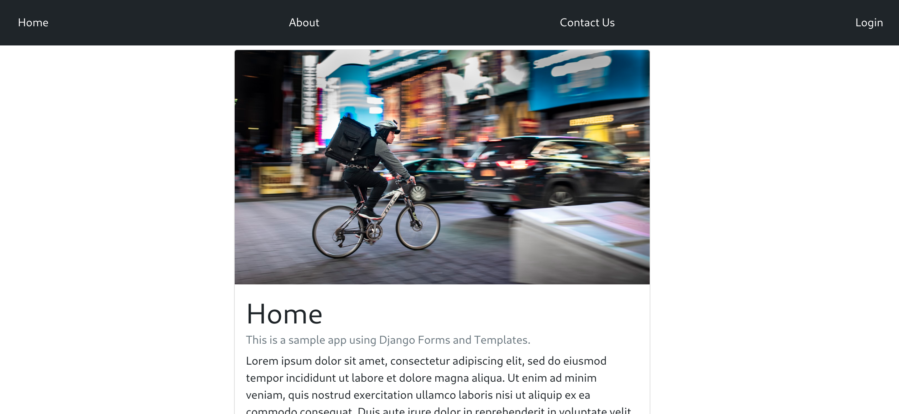

#### Login View
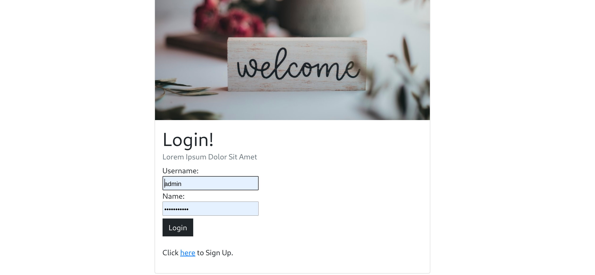

#### SignUp View
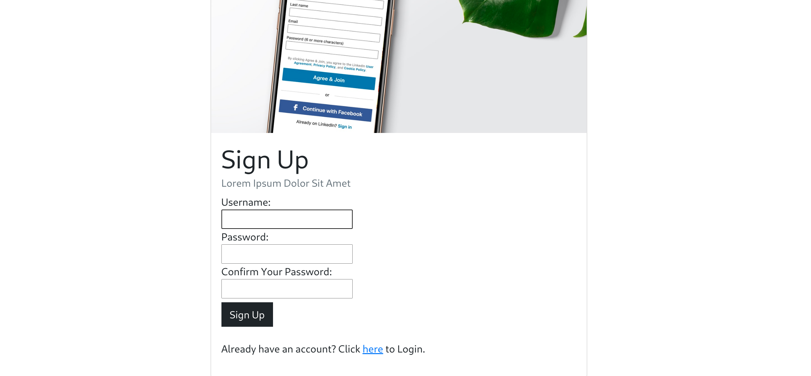

#### Nutrients List View
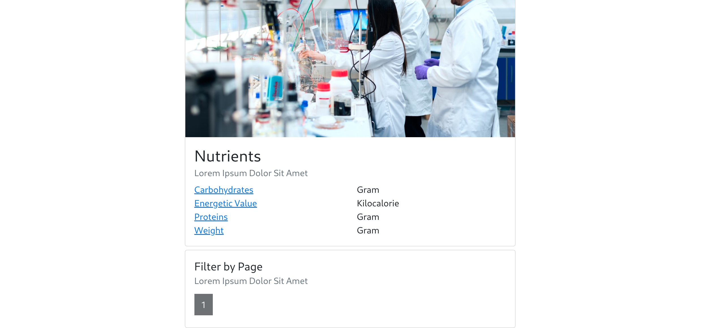
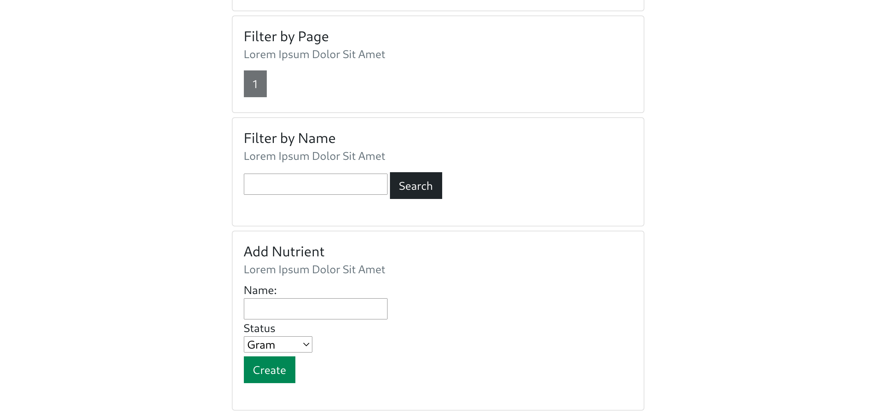

#### Nutrient Details View

#### Products List View
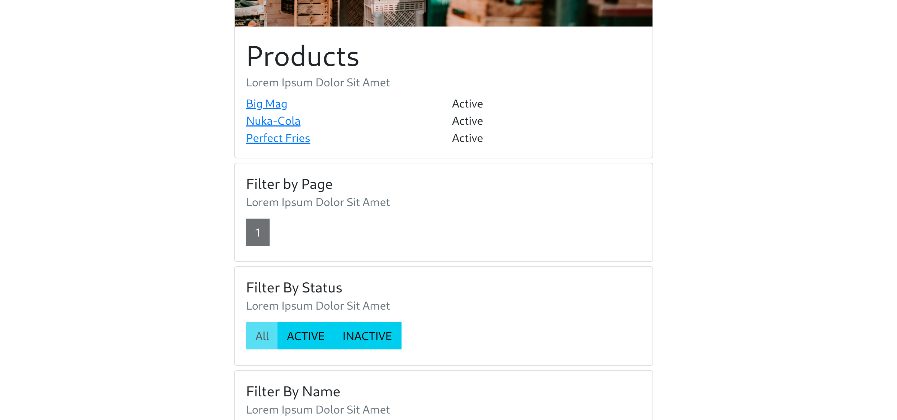

#### Product Details View
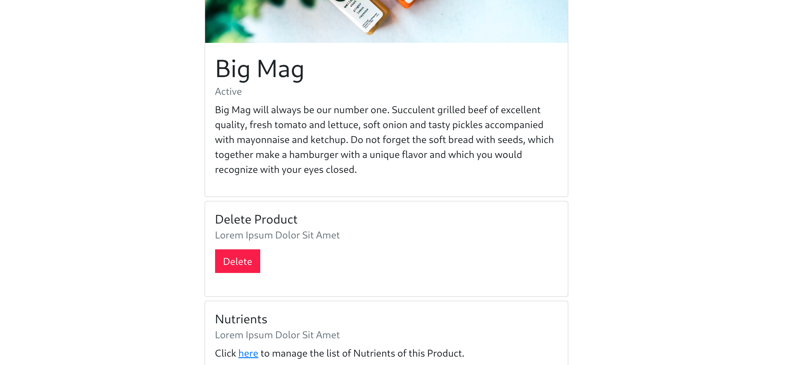
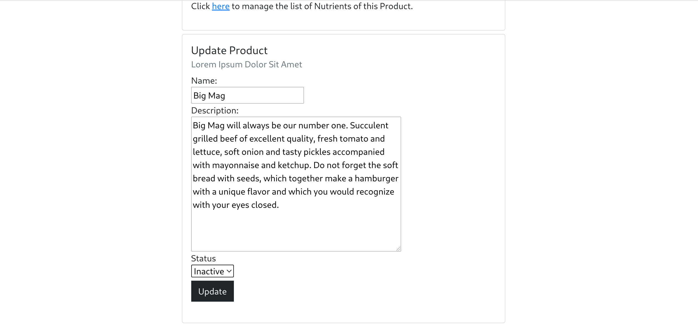

#### Product Nutrients List View
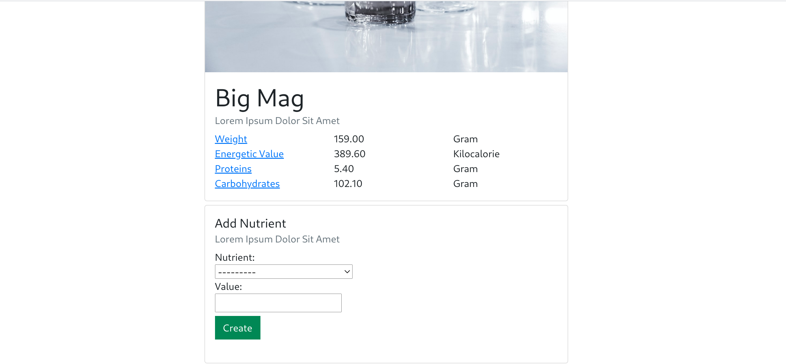

#### Product Nutrient Details View
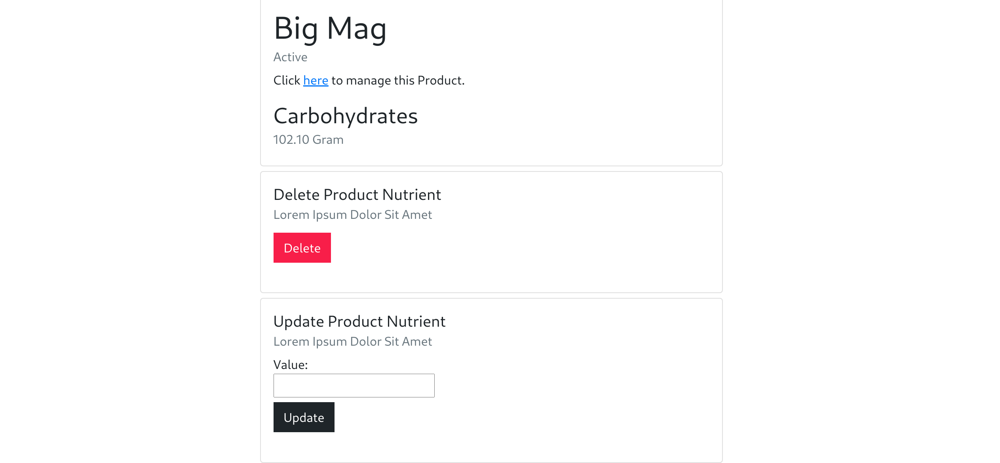

#### Logout View
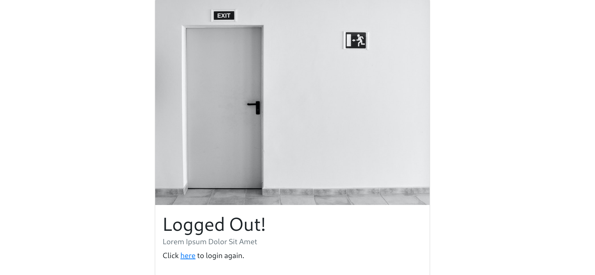
